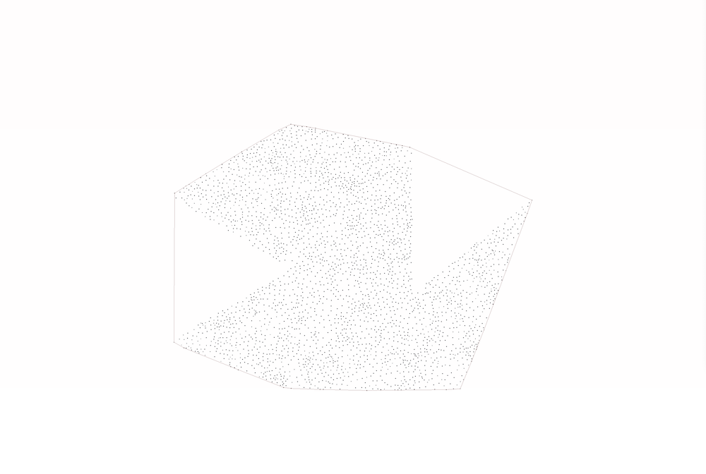

# Convex Hull
This is an implementation of the Graham’s scan algorithm. The program takes a file containing 2D points. 

## Program Input 
The input should be a collection of 2D points: 


## Program Output 
The output of the program is a polygon: 


# Building the project
To run use cmake. Make a directory called build, go into it and call cmake from there. 
```
mkdir build
cd build
cmake ../
```
Now you can call ``make`` to create the binary files and run the programs. 